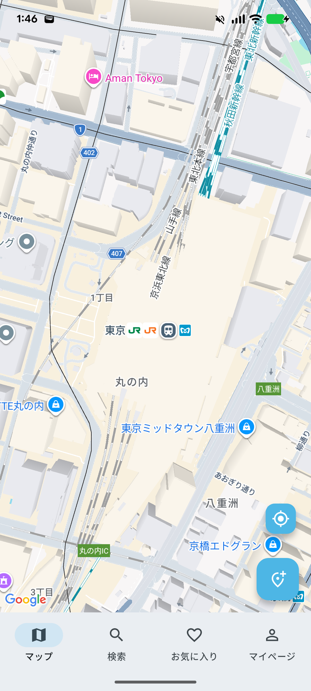

# 自販機ナビ（Vending Navi）

## スクリーンショット

## 概要

「今飲みたいドリンクを買える自販機を探す」ことを目的としたモバイルアプリです。

## 背景

外出先で「この飲み物が飲みたい」と思っても、どの自販機にあるかわからないという課題を感じたため開発しました。

## 使用技術

* Flutter（Dart）
* Firebase

  * Firestore（データ管理）
  * Authentication（認証）
  * Storage（画像保存）
* Google Maps API

## 主な機能

* 地図上で自販機を表示
* 自販機の登録
* 写真投稿
* タグによる情報分類

## アーキテクチャ

Flutter（フロントエンド）からFirebaseに直接アクセスする構成で、シンプルかつ高速な開発を意識しています。

## 今後の予定

* AWS（API Gateway / Lambda）によるAPI追加
* データ集計機能
* UI改善

## 開発状況

開発中（MVP開発中）

## 作者

mekido
