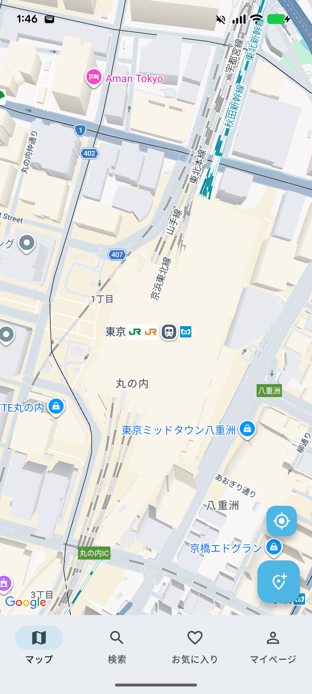

# 自販機ナビ（Vending Navi）

> Release status (2026-08-31): **NO-GO**. versionCode 17 must not be
> promoted to Production. The current P0/P1 remediation status is tracked in
> `docs/v2/PHASE_A_RELEASE_IDENTITY_REMEDIATION.md`.

## スクリーンショット

---

## 概要

「今飲みたいドリンクを買える自販機を探す」ことを目的としたモバイルアプリです。

ドリンク名（例：綾鷹、BOSSなど）から検索し、近くで購入できる自販機をマップ上で確認できます。

---

## 主な機能

- マップ上で近くの自販機を表示
- ドリンク名で自販機を検索
- 自販機の登録・編集
- ドリンク情報の登録・更新
- お気に入り機能

---

## 使用技術

- Flutter（Dart）
- Firebase
  - Firestore（データ管理）
  - Authentication（認証）
- Google Maps API

---

## 背景

外出先で「この飲み物が飲みたい」と思っても、どの自販機にあるかわからないという課題を感じたため開発しました。

---

## アーキテクチャ

公開情報はFlutterからFirestoreを直接読み取り、公開データへの登録・更新・報告は認証済みCallable Functionsを経由します。

---

## プライバシー文書

このREADMEはプライバシーポリシーではありません。情報の取扱いと削除方法は、[プライバシーポリシー](https://vendingnavi.web.app/privacy)と[アカウント削除ページ](https://vendingnavi.web.app/delete-account)を参照してください。文書の更新は、確認後にHostingへ別途反映します。

---

## 注意事項

- 自販機の情報はユーザー投稿に基づきます
- 実際の販売内容と異なる場合があります
- 私有地や立ち入り禁止エリアには入らないようにしてください

---

## アカウント削除

アプリ内削除とWeb削除手段を提供しています。Play配布版1.0.0（version code 19）で専用テストアカウントのProduction削除E2Eを確認しました。証跡と残る文書・運用上の確認事項は[Phase D closeout](docs/v2/PHASE_D_ACCOUNT_DELETION_CLOSEOUT.md)を参照してください。

## 開発状況

初回本番公開前・P0/P1是正中

---

## 作者

mekido
